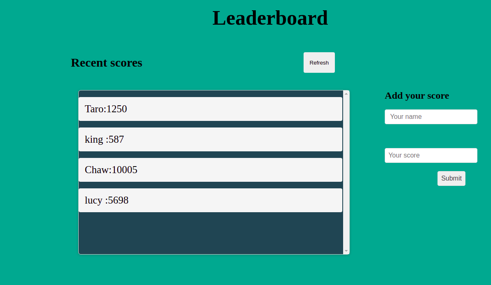

# Leaderboard

> Building leaderboard project with webpack, Css, JavaScript. This project can be able to get and send data to an api. 

Built this porject using HTML ,CSS and Webpack .

## [Live link]()
coming soon!

## Built With

- HTML
- CSS
- JavaScript
- webpack

## Getting Started


To get a local copy up and running follow these simple example steps.

### Prerequisites
- node js
- visual studio 
- webpack  

### Setup
To get a copy of this project follow the steps below
```
git@github.com:Tchilo/leaderboard.git
cd leaderboard
```


### Usage
in the terminal you can run the code below
```
npm start
```
### Run tests
Coming soon

### Deployment
Coming soon


## Authors

👤 **Author1**

- GitHub: [@Tchilo](https://github.com/Tchilo)

## 🤝 Contributing

Contributions, issues, and feature requests are welcome!

Feel free to check the [issues page](../../issues/).

## Show your support

Give a ⭐️ if you like this project!


## 📝 License

This project is [MIT](./MIT.md) licensed.